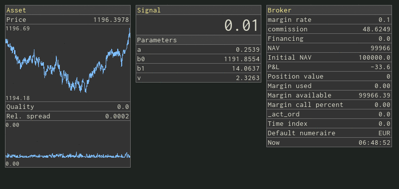

# periscope

periscope is a small collection of widgets building on top of the pygame package.

periscope can be used to build real-time dashboards resembling this one:

# Installation

Copy `periscope.py` module into your project and do `import periscope`.

# License

periscope is released under the MIT License. See LICENSE file for details.

Copyright (c) 2019 Julian Wergieluk
